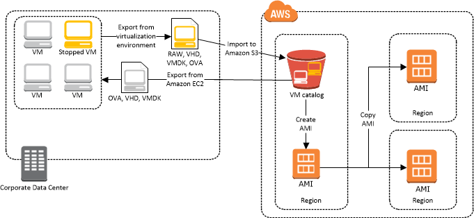
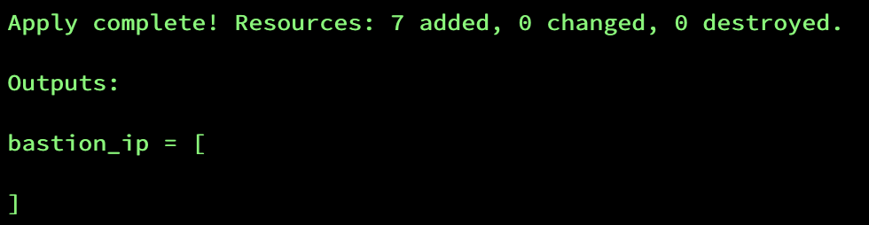
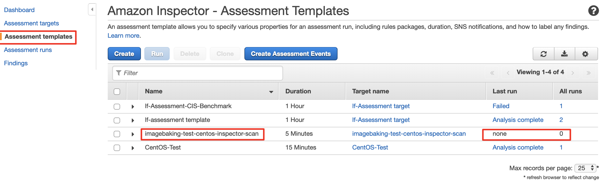
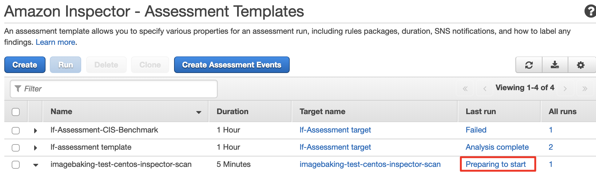

# Building Secure AWS AMIs

This is the code that accompanies my blog post series, "Building Secure AWS AMIs."

## Tutorial

In this tutorial, we cover building the prerequisite infrastructure to create EC2 AMIs from scratch, how to use the example hardening scripts for CentOS, and how to validate the testing with Amazon Inspector.

## 1: Prerequisites

First, download the code: https://github.com/kmcquade/building-secure-aws-amis-blog-series.git

```bash
git clone https://github.com/kmcquade/building-secure-aws-amis-blog-series.git
```

### 1.1: Installations

* Terraform

```bash
brew install tfenv
tfenv list-remote
tfenv install 0.12.17
```

* [AWS CLI](https://docs.aws.amazon.com/cli/latest/userguide/install-cliv2.html)


* Configure the AWS CLI by setting up your access keys and profiles, as described [here](https://docs.aws.amazon.com/cli/latest/userguide/cli-chap-configure.html)


* [aws-mfa](https://docs.aws.amazon.com/cli/latest/userguide/install-linux.html) - Not required, but strongly suggested


* Packer

```bash
brew install packer
```

* Ansible

```bash
brew install ansible
```


### 1.2: Setting up Terraform state

When you deliver your code, NEVER forget to leverage Terraform remote state. Otherwise, your terraform state file will be included locally. This is not only best practice, it's a security risk to use local Terraform state. I've seen multiple situations where access keys might be embedded in the Terraform code, or secrets were stashed in the local Terraform state and were not purged from the Git history.

You will be using the [terraform-aws-tfstate-backend module by Cloudposse](https://github.com/cloudposse/terraform-aws-tfstate-backend) module to create the Terraform remote state bucket.

#### 1.2.1: Background on Terraform state

Terraform state is used to describe and manage the state of your infrastructure and configuration. This state is used by Terraform to map real world resources to your configuration, keep track of metadata, and to improve performance for large infrastructures.

If you don’t specify remote state, this state is stored by default in a local file named "terraform.tfstate". It’s better to store it remotely, which works better in a team environment, and you remove the chance of losing track of (or deleting) the terraform state file on your local machine.

There are multiple [remote Terraform state backends](https://www.terraform.io/docs/backends) that you can use. We'll be using S3 for this tutorial.

You can find more information about the purpose of Terraform state [here](https://www.terraform.io/docs/state/purpose.html).

#### 1.2.2: Build the Terraform state bucket

* **Navigate to the directory where we will create the Terraform state bucket**. Create a few files where we will stash our code.

```bash
cd part1/terraform/tfstate
touch main.tf terraform.tf README.md
```

* Open the `main.tf` file in a text editor and insert the following:


```hcl
module "terraform_state_backend" {
  source     = "git::https://github.com/cloudposse/terraform-aws-tfstate-backend.git?ref=0.9.0"
  namespace  = "yourname"
  stage      = "dev"
  name       = "terraform"
  attributes = ["tfstate"]
  region     = "us-east-1"
}
```

* Open the `terraform.tf` file and insert the following:

```hcl
terraform {
  required_version = ">= 0.12.17"
}
```

* Now, let’s initialize the module, run the Terraform plan, then create the infrastructure:

```bash
terraform init
terraform plan
terraform apply -auto-approve
```

* Note in your AWS Console that an S3 bucket has been created with that name.

* Note that the directory has a file titled `terraform.tfstate`. As mentioned before, we don't want that to be stored locally - we want that to be stored in a remote Terraform state bucket. So, we will use the Terraform state bucket that we created to store the Terraform state that describes the same bucket.

* Open up the `terraform.tf` file and modify it to the following:

```hcl
terraform {
  required_version = ">= 0.12.17"
  backend "s3" {
    region         = "us-east-1"
    bucket         = "namespace-stage-name-tfstate" # TODO: Insert the name of your s3 bucket
    key            = "terraform.tfstate"
    dynamodb_table = "namespace-stage-name-terraform-state-lock" # TODO: Insert the name of your DynamoDB table
    encrypt        = true
  }
}
```

* Now we have to reinitialize Terraform to move the existing state.

```bash
terraform init
```

Terraform will detect that you're trying to move your state into S3 and ask, *"Do you want to copy existing state to the new backend?"*

* Enter "yes".
* Make sure you run terraform plan and apply as well.

```bash
terraform plan
terraform apply -auto-approve
```

Now the Terraform state is stored in the bucket, and the DynamoDB table will be used to lock the Terraform state so you can prevent concurrent modifications by other team members.

Let's proceed to building the VM Import S3 bucket, which we will also create with Terraform, and store that Terraform state in the bucket we just created.

## 2: Image Baking

### 2.1: Background



To build images in AWS, we need a few things:

* VM Import S3 Bucket: This is where we store the initial OVA file
* VM Import IAM Role: This is the service role used to create the AMI
* Packer Instance Profile: An instance profile for Packer to kick off other EC2 image baking builds.

### 2.2: Build the Packer Image Baking resources

* Navigate to the directory we will use to create the VM Import bucket. Create a few files where we will stash our code.

```bash
cd terraform/packer-resources
touch terraform.tf
```

* Open the `terraform.tf` file and insert the following:

```hcl
terraform {
  required_version = ">= 0.12.17"
  backend "s3" {
    region         = "us-east-1"
    bucket         = "namespace-stage-name-tfstate" # TODO: Insert the name of your s3 bucket
    key            = "us-east-1/packer-resources/terraform.tfstate"
    dynamodb_table = "namespace-stage-name-terraform-state-lock" # TODO: Insert the name of your DynamoDB table
    encrypt        = true
  }
}
```

This will create the following resources:
* AWS IAM Role, Policy, and Instance Profile for Packer: <description>
* VM Import Policy, Policy Attachment, and IAM Role
* S3 bucket for storing the uploaded image

Now run the code:
```bash
terraform init
terraform plan
terraform apply --auto-approve
```

### 2.3: Importing the from-scratch base image to AWS

Now we will import our from-scratch CentOS Image to AWS.

* In the `packer/` directory, modify the `env-local.sh` file to include:
  - the name of your VM Import bucket that you created in Step 1.1
  - the name of the VM Import role that you created in Step 1.2

```bash
#!/usr/bin/env bash
export AWS_REGION="us-east-1"
export BUCKET_NAME="personal-dev-vmimport"
export VM_IMPORT_ROLE_NAME="personal-dev-vmimport" # TODO: Make sure this matches the name of your VM Import role
```

* Export your access keys as environment variables.

* Run the commands:

```bash
source env-aws.sh
packer build -on-error=ask packer-aws-hardened-centos76.json
```

### 2.4: Building AWS AMIs from the base image

This should take about 30-40 minutes.

The build does the following in sequence:
* Creates an image with VirtualBox, generating an `.ova` file.
* Uploads the produced `.ova` file to the specified S3 bucket
* Uses [Packer's Amazon Import Post-Processor](https://www.packer.io/docs/post-processors/amazon-import.html) to kick off the [AWS VM Import](http://docs.aws.amazon.com/AWSEC2/latest/UserGuide/instances_of_your_vm.html) process, which creates an AMI from the uploaded `.ova` file.

{}
When the build finishes, it will create an AMI with the name `centos7-minimal-import-2020-05-01` (with the timestamp adjusted to today's date).
{}


### 2.5: Hardened CentOS 7.6 with Packer in AWS

* Modify the `env-aws.sh` file to fit your environment.
  - In POC environments, I suggest using the values for your default VPC.

```bash
#!/usr/bin/env bash
export AWS_REGION="us-east-1"
export SSH_USERNAME="centos" # Note: This is the default username for centos. Do not change it
export ENVIRONMENT="sbx" # TODO: Change this if you want.
export INSTANCE_TYPE="t2.small"
export SSH_PRIVATE_KEY_FILE="~/.ssh/my-private-key.pem" # TODO: Change the value of this to the name of your private key on your machine
export SSH_KEYPAIR_NAME="my-private-key" # TODO: This should be your private key pair name recognized by AWS.
```

* Export your access keys as environment variables
* Run the commands:

```bash
source env-aws.sh
packer build -on-error=ask packer-aws-hardened-centos76.json
```

{}
This should take about 20 minutes. When the build finishes, it will create an AMI with the name `centos7-hardened-base-2020-05-01` (with the timestamp adjusted to today's date).
{}


Packer will handle all of the following for you:
1. Spin up a new EC2 instance using the `centos7-minimal-import-2020-05-01` image that you created before
2. SSH into the instance using the SSH keypair specified
3. Upload the bash scripts used for hardening to the `/tmp` folder on the new machine
4. Run those bash scripts to harden the machine according to the CIS Benchmark and STIG compliance benchmark for RHEL and CentOS.
5. Shut down the machine
6. Create a snapshot of the volume
7. Create an AMI based on that snapshot

The final executed bash scripts also clean up the machine to remove log files, instance IDs, allowed SSH public keys, files in the `/tmp` folder, etc.


## 3: Run Amazon Inspector demo

### 3.1: Creating the test host and Amazon Inspector resources


This will actually run the Amazon Inspector to verify that the image is compliant with the CIS Hardening Benchmark for CentOS.

> Note: The Terraform module used for this will only work in us-east-1; this was set up for demo purposes.

* Navigate to the `./terraform/test-with-aws-inspector` directory
* Change the Terraform version

```bash
tfenv use 0.11.12
```

* Create a file titled `state.tf` in the `./terraform/test-with-aws-inspector` directory:

```hcl

# This bucket holds all infrastructure states so it should be created before apply
# Can be imported in state later, change this to your bucket or comment out

terraform {

  backend "s3" {
    region         = "us-east-1"
    bucket         = "namespace-stage-name-tfstate" # TODO: Insert the name of your s3 bucket
    key            = "us-east-1/golden-image-demo/bastion-host-test/terraform.tfstate"
    dynamodb_table = "namespace-stage-name-terraform-state-lock" # TODO: Insert the name of your DynamoDB table
    encrypt        = true
  }
  required_version = "~> 0.11.12"
}

# terraform and provider configuration
provider "aws" {
  region  = "${var.region}"
  version = ">= 2.0.0"
}

```

* Create a file titled `terraform.tfvars` in the `./terraform/test-with-aws-inspector` directory:

```hcl
namespace = "imagebaking"
stage     = "test"
name      = "centos"
key_name  = "my-private-key" # TODO: Change this to the name of your key pair.

ec2_ami_name_filter = "centos7-hardened-base-2020-*"

# TODO: Modify to include your IP addresses. Feel free to remove unnecessary IPs.
allowed_inbound_cidr_blocks = [
  "10.0.0.0/8", "172.16.0.0/12", "192.168.0.0/16", # Private IP Addresses
  "" # Insert your own private IPs here
  ]
```

Now run the code:
```bash
terraform init
terraform plan
terraform apply
```

The output will look like this:



### 3.2. Running the Amazon Inspector scan

The terraform code above does not actually kick off the scan - it just creates the test infrastructure. To run the scan for this demo, you'll need to navigate to the Amazon Console.

From the console, go to Amazon Inspector => Assessment Templates, then select the name of your template. The template will have the name `imagebaking-test-centos-inspector-scan` if you provided `imagebaking` as the namespace, `test` as the environment, and `centos` as the name. See the example screenshot below.



Select the template you wish to run, and hit the "Run" button.

When you refresh the page, you'll see that the assessment is being run:



Wait for 15 minutes, and you can download the report. Download it as a PDF, and cross-reference the findings versus the list of Exclusions and false positives below.
